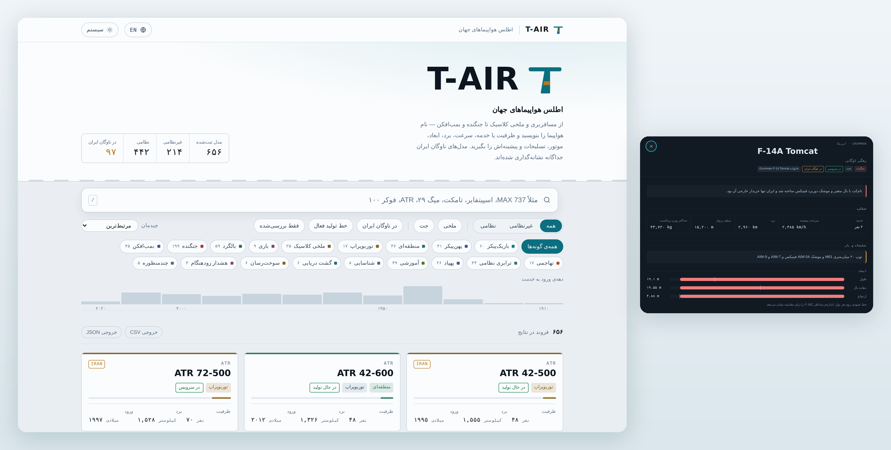
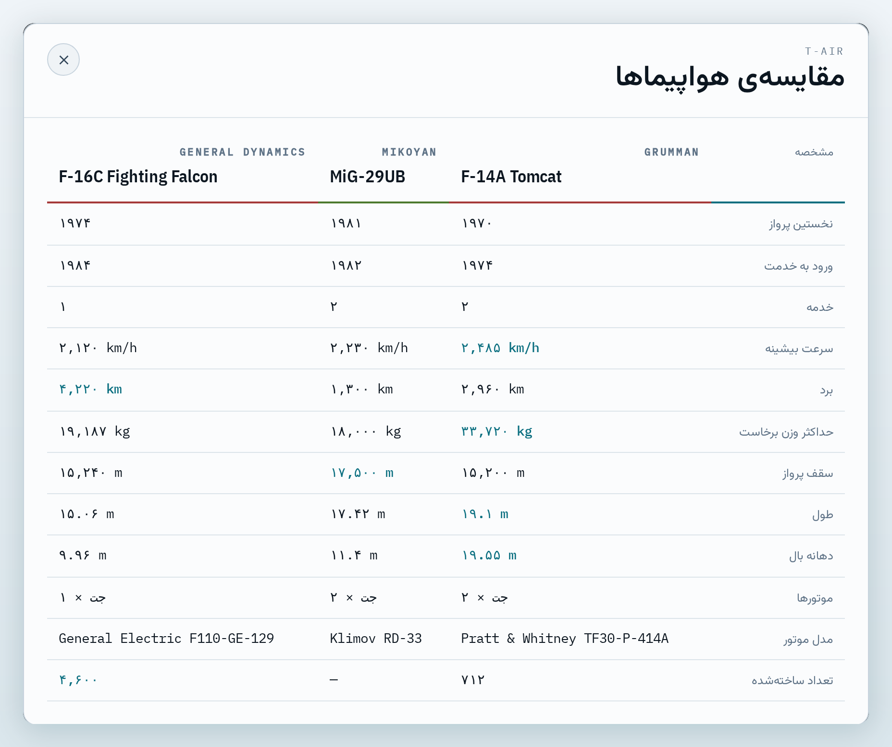
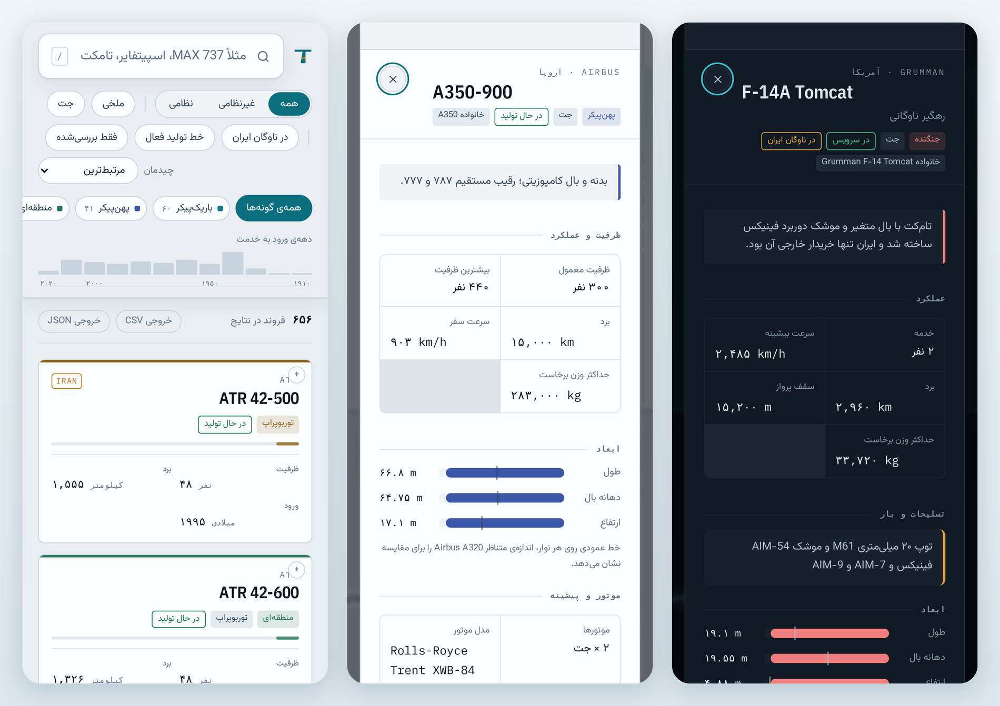

<p align="center">
  
</p>

<p align="center">
  <a href="https://aviatlas.github.io/t-air/"></a>
  <a href="https://github.com/aviatlas/t-air/releases/latest"></a>
  <a href="https://github.com/aviatlas/t-air/actions/workflows/checks.yml"></a>
</p>

<p align="center">
  
  
  
  <a href="LICENSE"></a>
  <a href="LICENSE-DATA.md"></a>
</p>

<p align="center">
  <b>اسم هواپیما را بنویسید — فارسی یا انگلیسی — و ظرفیت، سرعت، برد، ابعاد،<br>
  موتور، تسلیحات و پیشینه‌اش را بگیرید. ۶۵۶ مدل، از ایرباس تا اسپیتفایر.</b>
</p>

<p align="center">
  <a href="https://aviatlas.github.io/t-air/">
    
  </a>
</p>

<p align="center">
  <a href="https://aviatlas.github.io/t-air/"></a>
  <a href="https://github.com/aviatlas/t-air/releases/latest"></a>
  <a href="https://aviatlas.github.io/t-air/a/"></a>
</p>

---

## درباره‌ی T-AIR

**۶۵۶ مدل** هواپیما — ۲۱۴ کشوری و ۴۴۲ نظامی، از ۱۵۶ سازنده و ۳۵ کشور. از بویینگ
۷۴۷ و ایرباس A350 تا اسپیتفایر، تام‌کت، میگ‌۲۹، بالگرد و پهپاد. **۹۷ مدل** از
آن‌ها در ناوگان ایران بوده یا هست و جداگانه نشانه‌گذاری شده‌اند.

هر رکورد یک **نسخه‌ی مشخص** است، نه یک خانواده: ۷۳۷-۸۰۰ و ۷۳۷ MAX 8 دو رکورد
جدا هستند، چون عددهایشان فرق می‌کند.

نه ثبت‌نامی دارد، نه تبلیغی، نه چیزی که پشت سرتان جایی فرستاده شود. یک سایت
ایستا است که کل داده‌اش همراه خودش می‌آید.

## قابلیت‌ها

| | |
|---|---|
| **جست‌وجوی دوزبانه** | «بویینگ ۷۳۷» و `boeing 737` یک نتیجه می‌دهند؛ نگارش‌های مختلف فارسی و اعداد فارسی پشتیبانی می‌شوند |
| **فیلترها** | دسته، گونه با شمارش زنده، پیشران، ناوگان ایران، خط تولید فعال، و «فقط بررسی‌شده» |
| **نمودار دهه** | شکل مجموعه را نشان می‌دهد و خودش فیلتر هم هست |
| **مقایسه** | تا سه هواپیما کنار هم، با نشانه‌گذاری بیشترین مقدار هر سطر |
| **لینک مستقیم** | `#/f-14a` — با دکمه‌ی کپی لینک و پشتیبانی از دکمه‌ی بازگشت |
| **خروجی داده** | CSV و JSON از همان مجموعه‌ای که فیلتر کرده‌اید |
| **دو زبان کامل** | فارسی RTL و انگلیسی LTR؛ هر ۶۵۶ رکورد توضیح، نقش و تسلیحات انگلیسی دارد |
| **تم** | روشن، تیره، یا پیروی از سیستم |
| **بدون اینترنت** | بعد از اولین بازدید آفلاین کار می‌کند؛ روی گوشی «افزودن به صفحه‌ی اصلی» بزنید |
| **چاپ** | رکورد باز شده مثل یک برگه‌ی مشخصات چاپ می‌شود |

سه هواپیما را کنار هم بگذارید و بیشترین مقدار هر سطر خودش علامت می‌خورد:

<p align="center">
  
</p>

## روی گوشی

همان سایت است، نه نسخه‌ی خلاصه‌شده. با **«افزودن به صفحه‌ی اصلی»** مثل یک
برنامه باز می‌شود و بعد از اولین بازدید بدون اینترنت کار می‌کند.

<p align="center">
  
</p>

## چرا این یکی فرق دارد

بیشتر مرجع‌های آنلاین عدد را نشان می‌دهند و درباره‌ی اعتبارش ساکت‌اند. اینجا:

- **۴۸۵ رکورد از ۶۵۶ فیلد به فیلد با مقاله‌ی ویکی‌پدیای همان مدل مقایسه شده‌اند** و
  در صفحه‌ی خودشان علامت دارند — همراه با **تاریخ** بررسی، چون مقاله ممکن است
  بعداً عوض شود
- رکوردی که بررسی نشده، **خودش می‌گوید بررسی نشده**. سکوت درباره‌ی آن، خواننده را
  به اشتباه می‌انداخت
- **۶۰۵ اصلاح** با دلیلشان در `scripts/fixes/` ثبت است — معلوم است چه عددی، کِی و
  بر چه اساسی عوض شده
- وقتی تیراژ منتشرشده مربوط به کل خانواده است نه آن نسخه، کنار عدد نوشته می‌شود
  «کل خانواده»
- **۴۰ بررسی خودکار روی داده** و **۲۴ بررسی روی رابط** با هر پوش اجرا می‌شوند.
  این‌ها آرایش نیستند: یکی‌شان جابه‌جایی سرعت و برد ۴۰ بالگرد را گرفت، یکی دیگر
  هواپیمایی را که قبل از نخستین پروازش وارد خدمت شده بود

## سه راه استفاده

| | |
|---|---|
| **۱. در مرورگر** | [aviatlas.github.io/t-air](https://aviatlas.github.io/t-air/) — چیزی نصب نمی‌شود |
| **۲. یک فایل، آفلاین** | از [Releases](https://github.com/aviatlas/t-air/releases/latest) فایل `t-air-*.html` را بگیرید. کل اطلس داخل همان یک فایل است — داده، رابط و فونت‌ها. می‌شود در تلگرام فرستادش و طرف مقابل بدون اینترنت همه‌ی ۶۵۶ هواپیما را دارد |
| **۳. داده‌ی خام** | `aircraft-*.json` در همان Releases، یا دکمه‌های خروجی CSV/JSON در خود سایت |

<details>
<summary><b>اجرای محلی و بازسازی داده</b></summary>

```bash
git clone https://github.com/aviatlas/t-air.git
cd t-air
python3 -m http.server 8000     # بعد http://localhost:8000
```

هیچ مرحله‌ی build ای برای دیدن سایت لازم نیست. برای بازسازی داده:

```bash
bash scripts/check.sh
```

داده را از نو می‌سازد، ۴۰ بررسی دیتابیس و ۲۴ بررسی رابط را اجرا می‌کند، و
نسخه‌ی تک‌فایلی و صفحه‌های ایستا را به‌روز می‌کند.

</details>

## صفحه‌ی مستقل برای هر هواپیما

کنار برنامه‌ی تک‌صفحه‌ای، هر رکورد یک صفحه‌ی ایستا هم دارد: `a/<id>.html`.

دلیلش این است که موتور جست‌وجو چیزی را که بعد از `#` می‌آید نمی‌بیند؛ بدون این
صفحه‌ها گوگل فقط **یک** صفحه از این سایت می‌شناخت و ۶۵۶ هواپیما هرگز پیدا
نمی‌شدند. این صفحه‌ها با هر build از همان داده ساخته می‌شوند و رابط دومی برای
نگهداری نیستند.

## داده، منبع و مجوز

- داده از منابع عمومی جمع شده و بخش بررسی‌شده‌اش با مقاله‌ی ویکی‌پدیای همان مدل
  مقایسه شده است. **این یک مرجع عملیاتی پرواز نیست** — برای کار جدی به کتابچه‌ی
  رسمی سازنده مراجعه کنید
- کد **MIT**. داده **CC BY-SA 4.0** — همان مجوز ویکی‌پدیا، که بخشی از داده از آن
  گرفته شده و **تغییر کرده است**؛ جزئیاتش در [`LICENSE-DATA.md`](LICENSE-DATA.md)
- عکس‌ها فقط از **ویکی‌مدیا کامانز** و فقط با مجوز آزاد گرفته می‌شوند؛ زیر هر عکس
  نام عکاس، مجوز و لینک به صفحه‌ی فایل نوشته می‌شود. عکس‌ها مجوز عکاس خودشان را
  نگه می‌دارند
- ساختن کتابخانه‌ی عکس، روی GitHub: **Actions → Fetch fonts and photographs →
  Run workflow**؛ یا محلی: `python3 scripts/fetch_photos.py`
- گزارش مشکل امنیتی: [`SECURITY.md`](SECURITY.md)

## مشارکت

اگر عددی اشتباه است، [یک issue باز کنید](../../issues/new/choose) — فرمش شناسه‌ی
رکورد، فیلد غلط و منبع را می‌پرسد. بدون منبع نمی‌شود اصلاح را ثبت کرد.

جدول‌های داده را دستی ویرایش نمی‌کنیم؛ هر اصلاح لایه‌ی جدای خودش را در
`scripts/fixes/` دارد تا معلوم بماند چه چیزی و چرا عوض شده.
[`CONTRIBUTING.md`](CONTRIBUTING.md) روش کار را می‌گوید.

<details>
<summary><b>ساختار پروژه</b></summary>

```
index.html                    صفحه‌ی اصلی
assets/styles.css             توکن‌های تم، تایپوگرافی، چیدمان
assets/app.js                 جست‌وجو، فیلتر، مقایسه، صفحه‌ی جزئیات
assets/i18n.js                رشته‌های رابط در دو زبان
assets/fonts/                 فونت‌های محلی (بدون وابستگی به Google Fonts)
data/aircraft.json            دیتابیس — خروجی build
a/<id>.html                   صفحه‌ی ایستای هر هواپیما
sw.js + manifest.webmanifest  کار بدون اینترنت و نصب روی گوشی

scripts/build_data.py         جدول پایه + ادغام + ترجمه + اصلاحات + اعتبارسنجی
scripts/parts/*.py            جدول‌های داده و ترجمه‌های انگلیسی
scripts/fixes/*.py            لایه‌ی اصلاحات ممیزی (۶۰۵ اصلاح)
scripts/build_single.py       → dist/ نسخه‌ی تک‌فایلی
scripts/build_pages.py        صفحه‌های ایستا + sitemap
scripts/fetch_photos.py       عکس‌های آزاد از ویکی‌مدیا کامانز
scripts/fetch_fonts.py        محلی‌کردن فونت‌ها
scripts/banner.py             ساخت دوباره‌ی بنر متحرک بالای همین فایل
scripts/shot.js + shot.py     ساخت دوباره‌ی تصویر اصلی
scripts/shots_features.js|py  تصویرهای بخش قابلیت‌ها و گوشی
scripts/test_build.py         ۴۰ بررسی داده
scripts/test_ui.js            ۲۴ بررسی رابط (Playwright)
scripts/check.sh              همه‌ی بالا با یک دستور
```

</details>

<details>
<summary><b>دو اسکیمای داده</b></summary>

یک جنگنده و یک مسافربری خودشان را با عددهای یکسان توصیف نمی‌کنند، پس دو جدول
هست که سر build در یک شکل رکورد ادغام می‌شوند:

- **کشوری** — ظرفیت معمول و بیشینه، سرعت **سفر**
- **نظامی** — خدمه، سقف پرواز، تسلیحات، نقش، سرعت **بیشینه**

قراردادهای دیگر: `spanM` برای بالگرد قطر روتور اصلی است؛ `crew` برای پهپاد صفر
است و این خالی نیست؛ `ceilingM` سقف سرویس است نه سقف شناوری.

</details>

## کارهای باقی‌مانده

- ۱۷۱ رکورد باقی‌مانده برای مقایسه با منبع
- ثبت شناسه‌ی نسخه‌ی مقاله کنار تاریخ بررسی
- ۷۱ رکورد بدون تیراژ و ۱۵ رکورد نظامی بدون سقف پرواز
- ساختن کتابخانه‌ی عکس‌ها

---

<p align="center">
  <sub>ساخته‌ی <a href="https://github.com/aviatlas">aviatlas</a> ·
  کد MIT، داده CC BY-SA 4.0 ·
  <a href="https://aviatlas.github.io/t-air/">aviatlas.github.io/t-air</a></sub>
</p>
